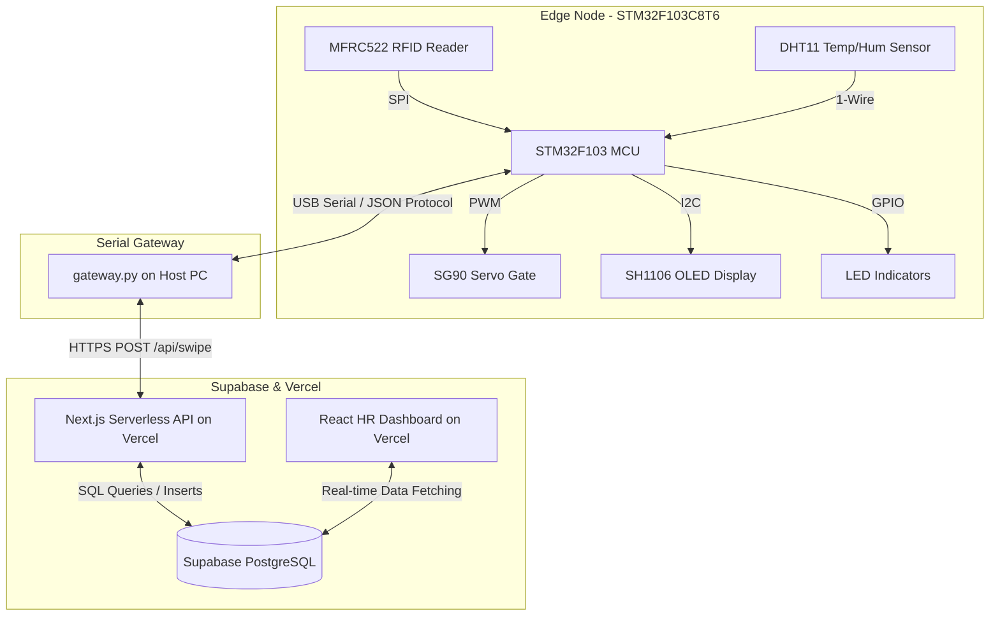
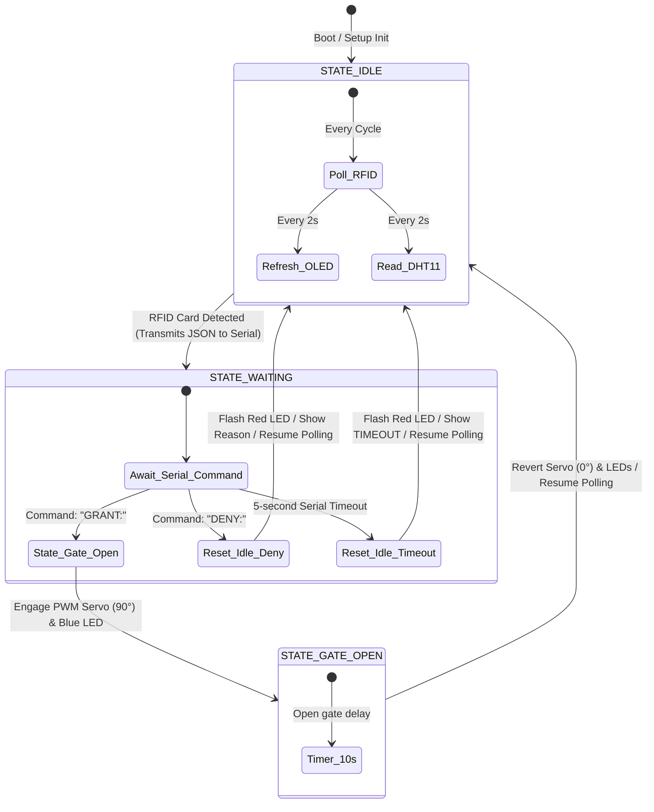

# GateIoT — Enterprise-Grade IoT Access Control & Attendance System

An end-to-end access control and real-time attendance management system integrating an **STM32F103C8T6** edge microcontroller, a lightweight **Python Serial Gateway**, a serverless **Next.js 16 Web Application** hosted on Vercel, and a **Supabase (PostgreSQL)** database.

---

## Technical Stack & Badges


---

## Table of Contents
1. [System Architecture](#system-architecture)
2. [Hardware Specifications & Wiring](#hardware-specifications--wiring)
3. [Database Schema (Supabase)](#database-schema-supabase)
4. [Serverless Web Backend & API](#serverless-web-backend--api)
5. [Continuous ML Trainer (TensorFlow.js)](#continuous-ml-trainer-tensorflowjs)
6. [Installation & Deployment Steps](#installation--deployment-steps)
7. [Firmware State Machine](#firmware-state-machine)
8. [Diagnostics & Troubleshooting](#diagnostics--troubleshooting)

---

## System Architecture



---

## Hardware Specifications & Wiring

### Component Matrix

| Component | Model | Interface | Operating Voltage | Purpose |
|---|---|---|---|---|
| **MCU** | STM32F103C8T6 | — | 3.3V / 5V | Central Edge Processor |
| **RFID Reader** | MFRC522 | SPI | 3.3V | Identity badge verification |
| **OLED Display** | SH1106 128×64 | I2C | 3.3V | User interface & diagnostic logs |
| **Micro Servo** | SG90 | PWM | 5.0V | Physical lock/gate barrier |
| **Temp/Humidity** | DHT11 | 1-Wire | 3.3V - 5V | Environmental telemetry |
| **Status LEDs** | Diffused Green/Blue + Red | GPIO | 3.3V | Visual feedback indicators |

---

## Database Schema (Supabase)

The system database is backed by PostgreSQL, managed via Supabase. Run the DDL setup found in [web/supabase/schema.sql](file:///D:/Work/Inker%20Robotics/gateiot/web/supabase/schema.sql) on your Supabase SQL Editor.

### Table Definitions

* **`employees`:** Contains personnel records, including mapped RFID UIDs, departments, and work schedules.
* **`swipe_logs`:** Captures entry/exit events, sensor telemetry, validation status, and denial logs.
* **`model_weights`:** Serves as a storage structure for TensorFlow.js model topologies/weights for predictive HR metrics.
* **`app_settings`:** Key-value system parameters (e.g., dashboard credentials, allowed swipe windows).
  * Key `entry_start` & `entry_end`: Limits entry scans (Default: `08:00` to `10:00`).
  * Key `exit_start` & `exit_end`: Limits exit scans (Default: `15:00` to `17:00`).
  * Key `timezone`: Target regional timezone (Default: `Asia/Kolkata`).

---

## Serverless Web Backend & API

### Business Rules & Access Policies
The backend endpoint `/api/swipe` processes requests under the following logic structure:
1. **Identity Resolution:** Checks if the scanned hex UID exists inside the `employees` table.
2. **Access Control Policies:**
   * Checks the count of `granted` logs for the active employee within the calendar day.
   * If the count is **$\ge 2$**, access is rejected (`reason: daily_limit`).
   * **Entry Window Lock:** If today's swipe count is 0 (first swipe of the day), it verifies that the current local time lies between the allowed entry time range. Otherwise, access is denied (`reason: invalid_entry_time`).
   * **Exit Window Lock:** If today's swipe count is 1 (second swipe of the day), it verifies that the current local time lies between the allowed exit time range. Otherwise, access is denied (`reason: invalid_exit_time`).

---

## Continuous ML Trainer (TensorFlow.js)

The HR Dashboard includes an in-browser machine learning execution tab that trains a feedforward neural network to predict employee productivity (productive work hours) based on scheduling and environmental parameters.

### 1. Neural Network Architecture
The trainer creates a 3-layer Dense Neural Network regressor:
* **Input Layer:** 7 normalized input features.
* **Hidden Layer 1:** 16 hidden units with Rectified Linear Unit (`ReLU`) activation + Dropout (rate: `0.1`).
* **Hidden Layer 2:** 8 hidden units with `ReLU` activation.
* **Output Layer:** 1 unit with Sigmoid activation (predicts normalized productive hours `0.0` to `1.0` representing a `0` to `24` hours scale).

### 2. Feature Definitions
For every completed workday (containing an Entry and Exit swipe log for the same employee), the dataset compiles the following variables:
1. **Entry Time:** Normalized minutes past midnight ($T_{\text{entry}} / 1440$).
2. **Exit Time:** Normalized minutes past midnight ($T_{\text{exit}} / 1440$).
3. **Weekday:** Normalized day index ($D_{\text{day}} / 6.0$, where Sunday = 0, Saturday = 6).
4. **Entry Temp:** Normalized DHT11 temperature at arrival ($\frac{T_{\text{temp}} - 15}{30}$).
5. **Entry Hum:** Normalized DHT11 humidity at arrival ($H_{\text{hum}} / 100$).
6. **Exit Temp:** Normalized DHT11 temperature at departure ($\frac{T_{\text{temp}} - 15}{30}$).
7. **Exit Hum:** Normalized DHT11 humidity at departure ($H_{\text{hum}} / 100$).

* **Label (Target):** $T_{\text{productive}} / 24.0$ (Normalized productive hours decimal between 0 and 1).

### 3. Model Training & Cloud Syncing
* **Optimizer:** Adam optimizer with a learning rate of `0.01`.
* **Loss Function:** Mean Squared Error (MSE), optimized for regression tasks.
* **Auto-Save:** Retained weight matrices and metrics are serialized to JSON and automatically synchronized to Supabase via `POST /api/model/save`.

### 4. Employee Performance Charts
* Uses **Recharts** to display employee attendance logs dynamically.
* The chart displays a composed layout for any selected employee:
  * **Actual Productive Hours** (vertical bars).
  * **Shift Target Hours** (8-hour red reference line).
  * **ML Predicted Productive Hours** (amber line overlaid dynamically by evaluating the latest trained model parameters on that employee's workday dataset).

---

## Installation & Deployment Steps

### Step 1: Database Setup (Supabase)
1. Navigate to the [Supabase Console](https://supabase.com) and open project **`dwvmhksojxkmwcvlxxne`**.
2. Select the **SQL Editor** tab from the left sidebar and click **New Query**.
3. Copy the database definition content from [web/supabase/schema.sql](file:///D:/Work/Inker%20Robotics/gateiot/web/supabase/schema.sql), paste it into the editor window, and click **Run**.
4. Navigate to **Project Settings → API** and copy the **Project URL**, **anon public**, and **service_role** API keys.

### Step 2: Web Application Deployment (Vercel)
1. Initialize git and push the project files to your GitHub repository:
   ```bash
   git init
   git add .
   git commit -m "Initial commit of GateIoT system"
   git branch -M main
   git remote add origin https://github.com/jasonjpulikkottil/gateiot.git
   git push -u origin main
   ```
2. Log into the [Vercel Dashboard](https://vercel.com).
3. Click **Add New... → Project**, import the `jasonjpulikkottil/gateiot` GitHub repository, and adjust these settings:
   * **Framework Preset:** Next.js
   * **Root Directory:** Select `web`
4. Under the **Environment Variables** section, input the credentials gathered from your Supabase panel:
   * `NEXT_PUBLIC_SUPABASE_URL` = `https://dwvmhksojxkmwcvlxxne.supabase.co`
   * `NEXT_PUBLIC_SUPABASE_ANON_KEY` = `<your-supabase-anon-key>`
   * `SUPABASE_SERVICE_ROLE_KEY` = `<your-supabase-service-role-key>`
5. Click **Deploy**. Note your public deployment URL (e.g., `https://gateiot-app.vercel.app`).

### Step 3: Start Python Gateway
Install the necessary communication modules and spin up the background serial bridge:
```bash
# Install dependencies
pip install pyserial requests

# Run gateway (pointing to the Vercel deployed instance)
python gateway.py --port COM3 --url https://gateiot-app.vercel.app
```

---

## Firmware State Machine



---

## Diagnostics & Troubleshooting

| Symptom / Error | Probable Root Cause | Resolution Steps |
|---|---|---|
| **Red LED blinks rapidly on startup** | The I2C connection to the SH1106 display has failed. | Verify I2C wiring (SCL on PB6, SDA on PB7) and check if the I2C physical address is `0x3C`. |
| **OLED screen outputs "TIMEOUT"** | The STM32F103C8T6 didn't receive a response from the host computer within 5 seconds. | Ensure `gateway.py` is actively running, connected to the correct COM/TTY port, and has internet access. |
| **OLED shows "DENIED: Bad Entry Time"** | Employee attempted to check in outside the configured entry window. | Swiping is restricted to entry window hours (Default: `08:00` to `10:00`). Adjust bounds in Dashboard Settings. |
| **OLED shows "DENIED: Bad Exit Time"** | Employee attempted to check out outside the configured exit window. | Swiping is restricted to exit window hours (Default: `15:00` to `17:00`). Adjust bounds in Dashboard Settings. |
| **OLED shows "DENIED: Unknown Card"** | The tapped RFID UID does not exist in the database. | Log into the React Dashboard page and add the employee profile matching that UID. |
| **OLED shows "DENIED: Limit Reached"** | The employee has hit the daily limit of 2 swipes. | Clear/reset the daily swipe logs for this employee inside the Supabase database if testing. |
| **Serial Exception: Access Denied** | Python cannot claim the serial resource. | Close any serial monitors (e.g. Arduino Serial Monitor) that might be holding the serial connection. |
| **Vercel Build Fails** | Vercel is looking for configurations at the root level instead of inside `/web`. | Go to Vercel Project Settings and verify the **Root Directory** setting is explicitly set to `web`. |